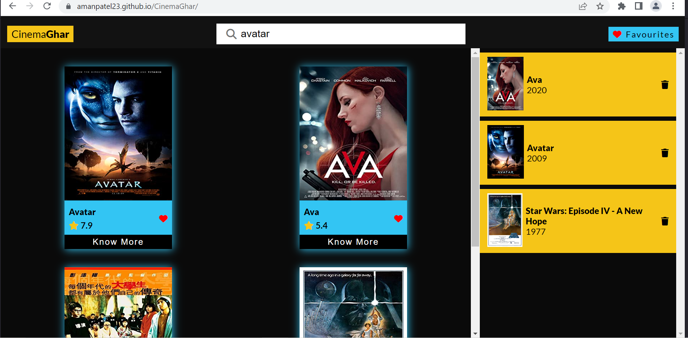
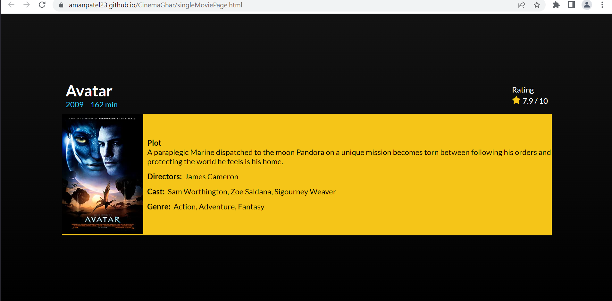

# CinemaGhar
## About
CinemaGhar is an IMDB clone app, made with the help of OMDB API, which allows users to search for movies while giving search suggetions. 
When a user clicks on a particular movie card, it opens up a new movie page containing more information about the movie.
Users can also add any movie to their favourites list, which stores the movies in local storage of the browser.

### Screenshots

